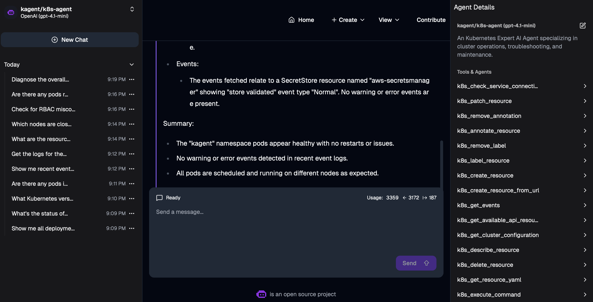

# KAgent on EKS

Kubernetes troubleshooting can quickly become complex as clusters grow and
workloads scale. Kagent makes it easier to ask your cluster questions in plain
English and get real answers.

Kagent is an AI-powered Kubernetes assistant that can interact with your
cluster, run commands, and support DevOps and SRE workflows. This guide walks
through installing Kagent from scratch, configuring an AI model, enabling the
built-in tools, and running your first Kubernetes query with natural language.

By the end, you’ll have a working Kagent setup on your EKS cluster.

```
kagent-eks-setup/
├── README.md
├── helm-values/
│   ├── 01-values-min.yaml            # initial install, all agents disabled
│   └── 03-values-enable-tools.yaml   # enables kagent-tools + k8s-agent
└── manifests/
    ├── modelconfig.yaml              # OpenAI ModelConfig (only if not auto-created by Helm)
    ├── eso-policy.json               # IAM policy for External Secrets Operator
    ├── secretstore.yaml              # ESO SecretStore -> AWS Secrets Manager
    └── externalsecret.yaml          # syncs kagent-openai secret from AWS
```

Before you start, replace all placeholder values (`REGION`, `ACCOUNT_ID`,
`CERT_ID`) with your real ones.

---

## 0. Prerequisites

```bash
aws eks update-kubeconfig --name <cluster-name> --region <region>
kubectl get nodes
kubectl config current-context   # confirm you're pointed at the right cluster
```

## 1. Install CRDs

```bash
helm install kagent-crds oci://ghcr.io/kagent-dev/kagent/helm/kagent-crds \
  --version 0.7.7 \
  --namespace kagent \
  --create-namespace
```

## 2. Create the OpenAI secret (quick path — swap for Part 4 if using Secrets Manager)

```bash
kubectl create secret generic kagent-openai \
  --from-literal=OPENAI_API_KEY=$OPENAI_API_KEY \
  -n kagent
```

## 3. Install KAgent (minimal)

```bash
helm install kagent oci://ghcr.io/kagent-dev/kagent/helm/kagent \
  --namespace kagent \
  --version 0.7.7 \
  -f helm-values/01-values-min.yaml
```

**Check whether Helm auto-created a `default-model-config`:**
```bash
kubectl get modelconfig -n kagent
```
Some chart versions (confirmed on `0.7.7`) ship a default ModelConfig
template automatically, already pointed at `kagent-openai` /
`OPENAI_API_KEY` / `gpt-4.1-mini`. If one already exists:

- **Do not** `kubectl apply -f manifests/modelconfig.yaml` — it will
  conflict with Helm's field ownership (`MalformedPolicyDocument`-style
  error, but for ModelConfig: *"conflict with kubectl-client-side-apply"*).
- Instead, patch it if values need changing:
  ```bash
  kubectl patch modelconfig default-model-config -n kagent --type merge -p '{
    "spec": {
      "apiKeySecret": "kagent-openai",
      "apiKeySecretKey": "OPENAI_API_KEY",
      "openAI": {"baseUrl": "https://api.openai.com/v1"}
    }
  }'
  ```

If `kubectl get modelconfig -n kagent` is **empty**, apply it directly:
```bash
kubectl apply -f manifests/modelconfig.yaml
```

Verify either way:
```bash
kubectl describe modelconfig default-model-config -n kagent
kubectl get pods -n kagent
```

## 4. Enable built-in tools + the k8s-agent

```bash
helm upgrade kagent oci://ghcr.io/kagent-dev/kagent/helm/kagent \
  --version 0.7.7 \
  --namespace kagent \
  -f helm-values/03-values-enable-tools.yaml

kubectl get agents -n kagent
kubectl get pods -n kagent
```

`READY` can briefly show `False` right after enabling — it takes ~30-60s
for the agent's backing deployment to come up. Re-check with:
```bash
kubectl describe agent k8s-agent -n kagent
```
Look for `Type: Ready, Status: True, Reason: DeploymentReady`.

## 5. Access the UI



```bash
kubectl -n kagent port-forward service/kagent-ui 8080:8080
```
Open `http://localhost:8080`.

If port 8080 is already taken locally:
```bash
lsof -i :8080          # find the PID
kill -9 <PID>          # or just use a different local port:
kubectl -n kagent port-forward service/kagent-ui 8081:8080
```

## 6. Run your first query

In the UI, select `k8s-agent` and ask:
```
What are the pods running in kagent namespace?
```

**If you get `429 insufficient_quota` / `credit_balance_exhausted`:**
this is an OpenAI billing issue, not a KAgent/EKS issue. Add credits at
`https://platform.openai.com/settings/organization/billing/`, then retry
the same query — no config changes needed.

More questions to try are in [`sample-queries.md`](#sample-queries) below.

---

## Part 4 — OpenAI key via AWS Secrets Manager + External Secrets Operator

Replaces the manual secret in Step 2 with a synced, rotation-friendly one.

```bash
# 1. Store the key
aws secretsmanager create-secret \
  --name kagent/openai-api-key \
  --secret-string '{"OPENAI_API_KEY":"sk-xxxxxxxx"}' \
  --region <region>

# 2. IAM policy (edit manifests/eso-policy.json with your REGION/ACCOUNT_ID first)
aws iam create-policy \
  --policy-name kagent-eso-secrets-policy \
  --policy-document file://manifests/eso-policy.json

# 3. IRSA service account
eksctl create iamserviceaccount \
  --name external-secrets-sa \
  --namespace kagent \
  --cluster <cluster-name> \
  --attach-policy-arn arn:aws:iam::<account-id>:policy/kagent-eso-secrets-policy \
  --approve

# 4. Install External Secrets Operator
helm repo add external-secrets https://charts.external-secrets.io
helm repo update
helm install external-secrets external-secrets/external-secrets \
  --namespace external-secrets \
  --create-namespace \
  --set installCRDs=true

# 5. Confirm CRDs landed
kubectl get crd | grep external-secrets
kubectl get crd secretstores.external-secrets.io -o jsonpath='{.spec.versions[*].name}'
# check whether it's v1 or v1beta1 — manifests/secretstore.yaml assumes v1

# 6. Apply SecretStore + ExternalSecret
kubectl apply -f manifests/secretstore.yaml
kubectl describe secretstore aws-secretsmanager -n kagent

kubectl apply -f manifests/externalsecret.yaml
kubectl get externalsecret -n kagent
kubectl get secret kagent-openai -n kagent
```

**Common errors hit here:**
- `no matches for kind "SecretStore" in version "external-secrets.io/v1beta1"`
  → your ESO version only serves `v1`. Check with the `jsonpath` command
  above and update `apiVersion` in both `secretstore.yaml` and
  `externalsecret.yaml` accordingly.
- `create-policy ... Syntax errors in policy` → you passed the JSON
  filename without `file://` prefix, or left `REGION`/`ACCOUNT_ID`
  placeholders in the ARN (IAM's parser can't handle raw `<>` characters).

---

## Troubleshooting Checklist

| Symptom | Likely cause | Fix |
|---|---|---|
| `INSTALLATION FAILED: conflict ... ModelConfig` | You manually applied a ModelConfig Helm also creates | `kubectl delete modelconfig default-model-config -n kagent`, then reinstall |
| `cannot reuse a name that is still in use` | A prior failed Helm release is still registered | `helm list -n kagent` (check for `failed`), `helm uninstall kagent -n kagent`, retry |
| `no matches for kind "SecretStore"` | ESO CRD version mismatch | check served versions, update `apiVersion` in manifests |
| `create-policy: Syntax errors in policy` | Missing `file://` prefix, or literal `<placeholder>` left in ARN | fix both |
| Agent `READY=False` right after enabling | Deployment still starting | wait ~30-60s, re-check `describe agent` |
| `429 insufficient_quota` in UI | OpenAI billing/credits, not KAgent | add credits, retry same query |
| `port-forward: address already in use` | Stale port-forward process | `lsof -i :8080` → `kill -9 <PID>`, or use a different local port |

---

## Sample Queries

**Read-only / safe first tests**
- What pods are running in the kagent namespace?
- Show me all deployments across all namespaces
- What's the status of my nodes?
- What Kubernetes version is this cluster running?

**Troubleshooting**
- Are there any pods in a CrashLoopBackOff state?
- Show me recent events in the kagent namespace
- Get the logs for the kagent-controller pod

**Resource & capacity**
- What are the resource requests and limits for pods in kagent namespace?
- Which nodes are closest to their CPU capacity?

**Security / RBAC**
- Check for RBAC misconfigurations in the kagent namespace
- Are there any pods running as root?

**Modification (test carefully, low-risk first)**
- Add a label 'env=test' to the kagent-ui deployment
- Scale the kagent-ui deployment to 2 replicas (then scale back)

**Multi-step reasoning**
- Diagnose the overall health of the kagent namespace and summarize any issues
